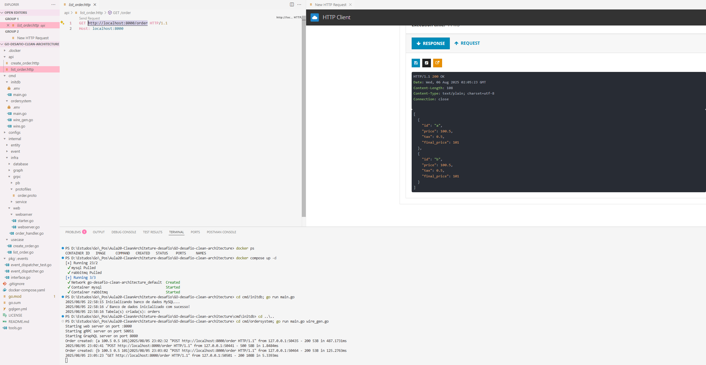
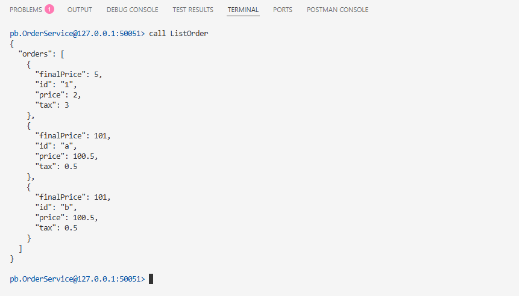
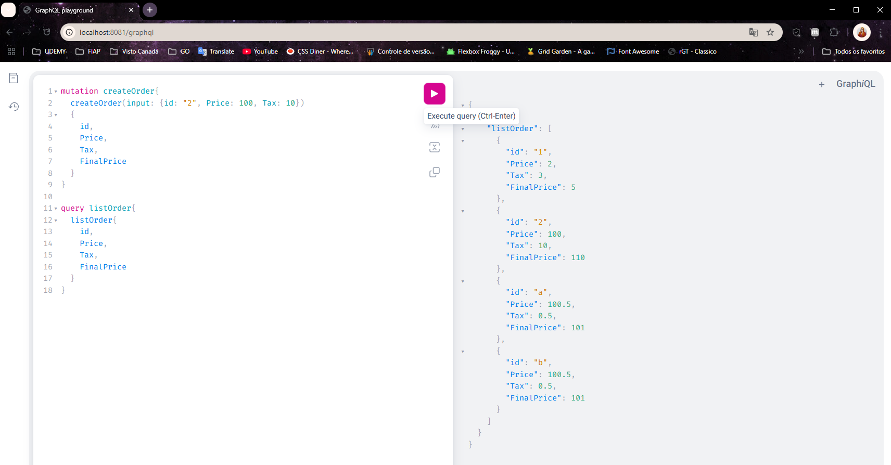

# 🏗️ Desafio Clean Architecture GO

[](https://golang.org)
[](https://docker.com)
[](https://mysql.com)
[](https://rabbitmq.com)
[](https://blog.cleancoder.com/uncle-bob/2012/08/13/the-clean-architecture.html)

## 📋 Sobre o Projeto

Este projeto é resultado de um **desafio prático** de implementação de Clean Architecture em Go. Partindo de uma base existente com funcionalidade de **CreateOrder**, foi desenvolvida a funcionalidade completa de **ListOrder** seguindo os mesmos padrões arquiteturais.

### 🎯 Objetivo do Desafio
Implementar a listagem de pedidos (ListOrder) em um sistema já existente, garantindo consistência arquitetural através de **múltiplas interfaces de acesso**:

- 🌐 **REST API** - Endpoints HTTP tradicionais
- ⚡ **gRPC** - Comunicação de alta performance  
- 🎯 **GraphQL** - Query language flexível

### 🏆 Funcionalidades Implementadas

- ✅ **Criar Pedido** (CreateOrder) - *Já existente*
- 🆕 **Listar Pedidos** (ListOrder) - **IMPLEMENTADO NO DESAFIO**
- ✅ **Persistência com MySQL**
- ✅ **Injeção de Dependência com Wire**
- ✅ **Event-Driven Architecture**

---

## 🚀 Desafio Proposto

**Contexto:** A partir de um projeto base com funcionalidade de criação de pedidos, implementar a funcionalidade de listagem mantendo os padrões de Clean Architecture.

### 📝 Requisitos do Desafio

1. **UseCase ListOrders** - Implementar a lógica de negócio
2. **REST Endpoint** - `GET /order` para listagem via HTTP
3. **gRPC Service** - `ListOrder` para comunicação RPC
4. **GraphQL Query** - `listOrder` para consultas flexíveis
5. **Migrações** - Estrutura de banco compatível
6. **Testes** - Arquivos `.http` para validação

---

## 🚀 Como Executar

### Pré-requisitos

- [Go 1.21+](https://golang.org/dl/)
- [Docker](https://www.docker.com/)
- [Docker Compose](https://docs.docker.com/compose/)

### ✨ Execução Automática

🚀 Subir tudo (banco + migrações + aplicação)
```bash
docker compose up --build -d
```

> ⚠️ **Primeira execução**: Pode demorar 1-2 minutos para os health checks validarem que MySQL e RabbitMQ estão prontos

### ✅ Confirmação dos Serviços

#### Verificar logs em tempo real da aplicação:
```bash
docker compose logs -f app
```

#### Se tudo estiver funcionando, você verá:
```
✓ Banco de dados inicializado com sucesso!
Starting web server on port :8000
Starting gRPC server on port 50051  
Starting GraphQL server on port 8081
```

### 🔄 Comandos Úteis

- Ver status dos containers:
```bash
docker compose ps
```
- Parar todos os serviços:
```bash
docker compose down
```

- Rebuild completo (limpar volumes)
```bash
docker compose down -v
docker compose up --build -d
```
- Ver logs de um serviço específico
```bash
docker compose logs mysql
docker compose logs rabbitmq
docker compose logs app
```

---

## 🧪 Como Testar

### 🌐 **REST API** - Porta 8000

#### Criar Pedido
```http
POST http://localhost:8000/order
Content-Type: application/json

{
    "id": "order-001",
    "price": 100.50,
    "tax": 10.05
}
```

#### Listar Pedidos
```http
GET http://localhost:8000/order
```

> 📁 **Arquivos de teste:** `api/create_order.http` e `api/list_order.http`

---

### ⚡ **gRPC** - Porta 50051

#### Usando Evans (Recomendado)

```bash
# Instalar Evans
choco install evans  # Windows
# ou baixar de: https://github.com/ktr0731/evans/releases

# Conectar
evans -r repl -p 50051

# Dentro do Evans:
package pb
service OrderService
call CreateOrder
call ListOrder
```

---

### 🎯 **GraphQL** - Porta 8081

#### GraphQL Playground
Acesse: **http://localhost:8081**

#### Mutations e Queries

**Criar Pedido:**
```graphql
mutation {
  createOrder(input: {
    id: "gql-001"
    Price: 200.0
    Tax: 20.0
  }) {
    id
    Price
    Tax
    FinalPrice
  }
}
```

**Listar Pedidos:**
```graphql
query {
  listOrders {
    id
    Price
    Tax
    FinalPrice
  }
}
```

---

## 📊 Arquitetura

```
🐳 DOCKER ARCHITECTURE
┌─────────────────────────────────────────┐
│            Container Services           │
│  MySQL    │ RabbitMQ │    App           │
│ :3306     │  :5672   │ :8000/:50051     │
└─────────────────────────────────────────┘
                    ⬇️
┌─────────────────────────────────────────┐
│           APPLICATION LAYERS            │
│  REST API  │  gRPC  │  GraphQL          │
├─────────────────────────────────────────┤
│              Use Cases                  │
│  CreateOrder  │  ListOrder              │
├─────────────────────────────────────────┤
│               Entities                  │
│             Order                       │
├─────────────────────────────────────────┤
│            Infrastructure               │
│  Database  │  Events  │  Web            │
└─────────────────────────────────────────┘
```

---

## 📝 Estrutura do Projeto

```
├── cmd/
│   ├── initdb/          # Inicialização do banco
│   └── ordersystem/     # Aplicação principal
├── internal/
│   ├── entity/          # Entidades de domínio
│   ├── usecase/         # Casos de uso
│   └── infra/           # Infraestrutura
│       ├── database/    # Repositórios
│       ├── grpc/        # Servidor gRPC
│       ├── graph/       # GraphQL
│       └── web/         # REST API
├── api/                 # Arquivos de teste HTTP
└── docker-compose.yml   # Configuração Docker
```

---

## 🛠️ Tecnologias Utilizadas

### Core
- **Go 1.23** - Linguagem principal
- **MySQL 5.7** - Banco de dados relacional
- **RabbitMQ 3.0** - Message broker para eventos

### Frameworks & Libraries
- **Wire** - Injeção de dependência
- **Chi Router** - HTTP router minimalista
- **gRPC** - Comunicação RPC de alta performance
- **GraphQL (gqlgen)** - Query language flexível
- **GORM** - ORM para Go (se estiver usando)

### DevOps
- **Docker & Docker Compose** - Containerização
- **Health Checks** - Monitoramento de containers

---

## 📸 Evidências de Teste

### REST API


### gRPC


### GraphQL



---

## 📄 Licença

Este projeto está sob a licença MIT. Veja o arquivo [LICENSE](LICENSE) para mais detalhes.